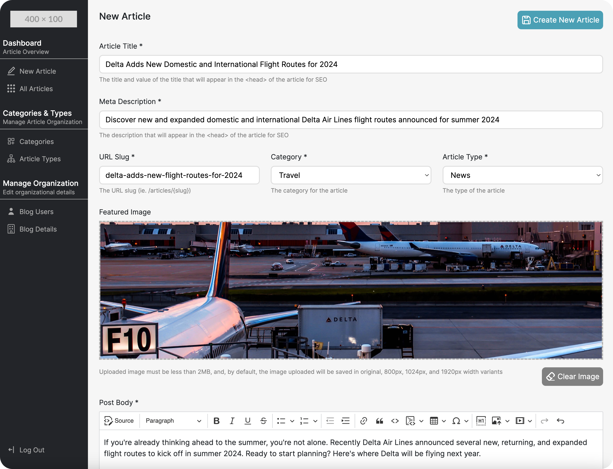

# Livewire Blog CMS

> Blog Content Management System (CMS) for Laravel Livewire, AlpineJS, and Bootstrap 5



## Features
- Quick and Painless Installation
- Lightweight and Integrable with Front-End Blog Templates
- Intuitive Interface
- Unlimited Customization Options
- User-Friendly Article Creation and Management
- Robust Article Categorization and Organizational Tools
- Comprehensive User and Blog Administration
- Streamlined SEO Optimization Tools
- Integrated Image Management System

## Installation
1. Install the package via composer
```bash
composer require jecharlt/livewire-blog-cms
```

2. Run the following
```bash
composer install
npm install
```

3. Append the following variables to your `.env` file and define them
```dotenv
LIVEWIRE_BLOG_CMS_ADMIN_USERNAME=
LIVEWIRE_BLOG_CMS_ADMIN_PASSWORD=
```

4. Run the install command
```bash
php artisan livewire-blog-cms:install
```

Congrats! Your CMS is ready to use. You can go ahead and log in with the username and password you defined above by 
visiting `/blog-admin-login`

## Customisation

The following are available to be published for additional customization

Assets:
```bash
php artisan vendor:publish --tag=":livewire-blog-cms-assets"
```

Views:
```bash
php artisan vendor:publish --tag=":livewire-blog-cms-views"
```

Config:
```bash
php artisan vendor:publish --tag=":livewire-blog-cms-config"
```

Migrations: 
```bash
php artisan vendor:publish --tag=":livewire-blog-cms-migrations"
```

Commands:
```bash
php artisan vendor:publish --tag=":livewire-blog-cms-commands"
```

Controllers:
```bash
php artisan vendor:publish --tag=":livewire-blog-cms-controllers"
```

Livewire Component Classes: 
```bash
php artisan vendor:publish --tag=":livewire-blog-cms-livewire-component-classes"
```

Models:
```bash
php artisan vendor:publish --tag=":livewire-blog-cms-models"
```

Routes:
```bash
php artisan vendor:publish --tag=":livewire-blog-cms-routes"
```

## Security Vulnerabilities
If you discover a security vulnerability within the CMS, please email John Charlton via [53029902b@gmail.com](mailto:53029902b@gmail.com)

## Credits
- [John Charlton](https://github.com/jecharlt)

## License
The MIT License (MIT). Please see [License File](LICENSE.md) for more information. 


